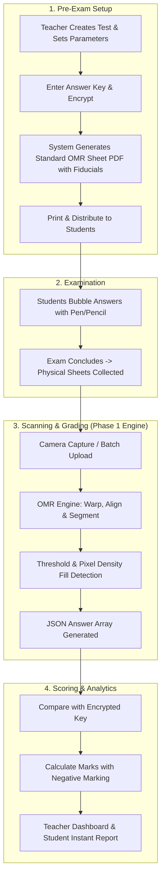

# 📄 AOTS — OMR Evaluation System
## System Architecture, CV Pipeline & Phase-1 Engine Specification

---

## 🎯 Executive Summary & Mission
**AOTS (Automated Optical Testing System)** conducts ECET competitive exam evaluations. Currently, teachers manually evaluate paper OMR sheets using answer keys and pens, leading to delayed results, human grading fatigue, and lack of actionable student analytics.

### The Objective
Build a robust, accurate, and automated OMR evaluation platform. 
**Phase 1 Target**: Laser-focused on **one single capability executed flawlessly**:
$$\text{Input: Camera Photo of OMR Sheet} \longrightarrow \text{Output: Accurate Detected Answers [Q1}\to\text{A, Q2}\to\text{C, ... Q50}\to\text{D]}$$

---

## 👥 Stakeholders & Access Matrix

```
┌────────────────────────────────────────────────────────────────────────┐
│                               USER ROLES                               │
├───────────────────┬──────────────────────────┬─────────────────────────┤
│ 👨‍💼 ADMIN          │ 👨‍🏫 TEACHER                │ 👨‍🎓 STUDENT              │
│ (Institute Head)  │ (Evaluator / Creator)    │ (Examinee)              │
├───────────────────┼──────────────────────────┼─────────────────────────┤
│ • Manage faculty  │ • Create ECET Mock Tests │ • Unique Student Login  │
│ • Institute-wide  │ • Lock/Encrypt Ans Keys  │ • Capture/Upload Sheet  │
│   performance     │ • Batch scan OMR sheets  │ • View Individual Score │
│ • Export reports  │ • Class item analysis    │   (One-time view)       │
└───────────────────┴──────────────────────────┴─────────────────────────┘
```

---

## 🔄 End-to-End Operational Lifecycle



---

## 🔬 Core OMR Computer Vision Pipeline (Phase 1 Engine)

The computer vision engine transforms an arbitrary, perspective-distorted smartphone photo into a normalized coordinate grid to read bubble states with high confidence.

```
┌──────────────┐     ┌──────────────┐     ┌──────────────┐
│ Stage 1:     │     │ Stage 2:     │     │ Stage 3:     │
│ Image Capture│ ──> │ 4-Corner     │ ──> │ Lighting &   │
│ & Pre-check  │     │ Homography   │     │ Binarization │
└──────────────┘     └──────────────┘     └──────────────┘
                                                 │
                                                 ▼
┌──────────────┐     ┌──────────────┐     ┌──────────────┐
│ Stage 6:     │     │ Stage 5:     │     │ Stage 4:     │
│ JSON Output  │ <── │ Dark-Pixel   │ <── │ Target Grid  │
│ & Confidence │     │ Thresholding │     │ Coordinates  │
└──────────────┘     └──────────────┘     └──────────────┘
```

---

### 🔍 Detailed Stage Breakdown

#### 1. Stage 1 — Image Acquisition & Quality Gate
* **Input**: JPEG/PNG image from mobile camera.
* **Validation Checks**:
  * **Blur Check**: Variance of Laplacian $(\sigma^2 < 100 \implies \text{flag blurred})$.
  * **Illumination Check**: Histogram distribution check to detect heavy shadows or overexposure.

#### 2. Stage 2 — Fiducial Marker / Corner Alignment & Perspective Transform
* **Sheet Geometry**:
  * 4 high-contrast **Corner Markers** (Solid Black Squares or ArUco-style fiducial boxes) at top-left, top-right, bottom-left, bottom-right.
* **Detection Logic**:
  * Find contours with 4 vertices approximating a convex polygon.
  * Sort coordinates: $[TL, TR, BR, BL]$.
* **Warping**:
  * Calculate Perspective Transform Matrix: $M = \text{cv2.getPerspectiveTransform}(src, dst)$.
  * Warp to standard reference canvas (e.g., $1200 \times 1600 \text{ px}$).

#### 3. Stage 3 — Image Cleaning & Preprocessing
* **Grayscale Conversion**: Eliminates color variance and ink color bias (blue vs black ink).
* **Gaussian Blur**: Kernel $(5 \times 5)$ to eliminate paper grain and sensor noise.
* **Adaptive / Otsu Thresholding**:
  * Converts the image into a binary matrix ($\text{Filled} = 255$, $\text{Background} = 0$).
  * Dynamic thresholding handles non-uniform ambient light and localized hand shadows.

#### 4. Stage 4 — Bubble Location & Coordinate Grid System
* **Coordinate Mapping Strategy**: **Deterministic Layout Grid** (Approach B).
* Since AOTS uses a fixed, standardized sheet layout, every bubble is defined as a normalized relative bounding box:
  $$\text{Bubble}(Q_i, \text{Opt}_j) = [X_{\text{rel}}, Y_{\text{rel}}, W_{\text{rel}}, H_{\text{rel}}]$$
* **Grid Structure (Example for 50 Questions, 4 Options A/B/C/D)**:
  * **Column 1**: Questions 1 to 25
  * **Column 2**: Questions 26 to 50
  * **Option Offsets**: Fixed pitch $(\Delta x, \Delta y)$ between option centers.

#### 5. Stage 5 — Filled vs. Empty Decision Engine
* **Region of Interest (ROI)**: For each bubble, extract a circular/square ROI with an inner mask (ignoring the printed bubble outline ring).
* **Fill Ratio Calculation**:
  $$\text{Fill Ratio} = \frac{\sum \text{Foreground Pixels inside Mask}}{\text{Total Inner Mask Pixels}} \times 100\%$$
* **Multi-Tier Classification Rules**:
  * $\text{Fill Ratio} \ge 45\%$: **FILLED**
  * $\text{Fill Ratio} \le 18\%$: **EMPTY**
  * $18\% < \text{Fill Ratio} < 45\%$: **MARGINAL / SUSPICIOUS** (Check relative contrast against other options in same question)
* **Single vs. Multiple Marks**:
  * Exactly 1 option $> \text{Threshold}$: **Valid Answer**
  * 0 options $> \text{Threshold}$: **UNANSWERED**
  * $\ge 2$ options $> \text{Threshold}$: **AMBIGUOUS / MULTI-MARKED** (Flagged with warning)

#### 6. Stage 6 — Data Structuring & Confidence Output
* Produces clean, typed JSON output detailing the raw readings and confidence per question.

```json
{
  "test_code": "SM-ECET-003",
  "student_id": "ECET-2026-042",
  "status": "SUCCESS",
  "overall_confidence": 0.982,
  "results": [
    {
      "question": 1,
      "selected": "A",
      "fill_ratios": { "A": 88.4, "B": 4.1, "C": 5.2, "D": 3.8 },
      "status": "ANSWERED",
      "confidence": 0.99
    },
    {
      "question": 2,
      "selected": null,
      "fill_ratios": { "A": 5.1, "B": 6.0, "C": 4.3, "D": 4.8 },
      "status": "UNANSWERED",
      "confidence": 1.0
    },
    {
      "question": 3,
      "selected": "MULTIPLE",
      "fill_ratios": { "A": 72.1, "B": 68.4, "C": 4.0, "D": 3.1 },
      "status": "INVALID_MULTIPLE_FILLS",
      "confidence": 0.50
    }
  ]
}
```

---

## 🛡️ Edge Cases & Robustness Matrix

| Challenge / Edge Case | Cause | Engine Defense Strategy |
|---|---|---|
| **Uneven Illumination & Shadows** | Hand shadow during phone capture | Localized Adaptive Thresholding & Relative Contrast Normalization per bubble group |
| **Incomplete Bubble Filling** | Light tick / partial cross / pencil smudge | Relative fill comparison (highest peak vs background baseline) + confidence score |
| **Erased Pencil Marks** | Residual graphite after erasing | Differential threshold (true fill typically $> 55\%$, erased ghost marks usually $< 25\%$) |
| **Camera Skew & Perspective** | Photo shot at $30^\circ$ angle | 4-point Quadrilateral Contour detection + Homography Warp Transform |
| **Rotated Uploads** | Sheet upside down or sideways | Orientation alignment markers (unique asymmetric corner pattern or orientation barcode) |
| **Folded / Crumpled Paper** | Sheet handled roughly by student | Fiducial anchor subdivision (grid section recalibration) |

---

## 🗺️ Implementation Roadmap

```
├── PHASE 1 (Current Focus) ── Core OMR Vision Engine
│   ├── Step 1.1: OMR Template Spec Definition (Coordinates & Geometry)
│   ├── Step 1.2: Perspective Unwarping & Normalization
│   ├── Step 1.3: ROI Masking & Bubble Fill Calculation
│   └── Step 1.4: Validation against Sample Test Sheets
│
├── PHASE 2 ────────────────── Grading & Scoring Module
│   ├── Step 2.1: Key Encryption & Comparison Engine
│   └── Step 2.2: Negative Marking & Total Computation
│
├── PHASE 3 ────────────────── Data Persistence & API
│   ├── Step 3.1: SQLite/PostgreSQL Database Schema
│   └── Step 3.2: Test, User & Result Management APIs
│
├── PHASE 4 ────────────────── Web Application Frontend
│   ├── Step 4.1: Camera Capture & Instant Result Modal for Students
│   └── Step 4.2: Teacher Dashboard (Batch Scanning & Answer Key Lock)
│
└── PHASE 5 ────────────────── Analytics, Export & Live Deployment
    ├── Step 5.1: Question Difficulty & Distractor Analysis
    └── Step 5.2: Excel/PDF Export for AOTS Platform
```

---

## 📌 Phase 1 Strict Goal Confirmation
> **Rule**: Build and test the pure CV engine until it reliably parses 100% of test OMR sample photos into structured JSON answers. No UI, no auth, no database distractions until the core vision pipeline achieves $\ge 98\%$ accuracy on real-world test sheets.
